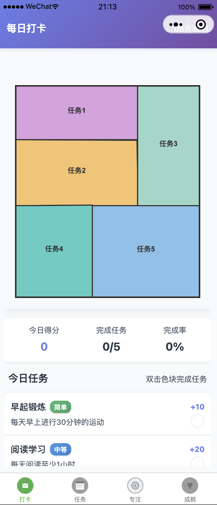

# 自律打卡小程序

一个基于微信小程序平台的自律打卡应用，通过色块消除游戏化方式培养用户的自律习惯。

## 📱 应用预览

> **截图说明**：以下截图展示了应用的主要功能界面。要获取最新的应用截图，请按照[截图指南](#截图指南)在微信开发者工具中进行截图。

### 主要功能界面

| 打卡页面 | 任务管理 | 专注模式 | 成就系统 |
|---------|---------|---------|----------|
|  |  |  |  |
| 游戏化打卡界面，支持色块消除 | 任务创建、编辑和管理 | 专注计时和统计功能 | 成就徽章和进度追踪 |

### 核心功能展示

- **🎮 游戏化打卡**：通过点击色块完成任务打卡，增加趣味性
- **📋 任务管理**：支持任务的增删改查，难度分级管理
- **⏰ 专注模式**：番茄钟计时功能，提升专注效率
- **🏆 成就系统**：多样化成就徽章，激励持续使用

## 项目概述

### 核心功能
- **游戏化打卡**：通过随机多边形分割和色块消除的方式进行打卡
- **任务管理**：创建、编辑和管理个人任务，支持难度等级设置
- **数据统计**：提供日历视图、图表分析和成就系统
- **社交分享**：支持分享打卡成果到微信好友和朋友圈
- **激励系统**：每日名言、成就徽章和进度追踪

### 技术栈
- **前端框架**：微信小程序原生开发
- **渲染引擎**：Skyline渲染引擎 + WebGL Canvas
- **开发语言**：TypeScript + JavaScript ES6+
- **样式语言**：WXSS (支持CSS3特性、Flexbox、Grid)
- **数据存储**：微信小程序本地存储API
- **图形渲染**：Canvas 2D API + 自定义渲染器
- **算法支持**：Voronoi图算法、矩形分割算法
- **开发工具**：微信开发者工具、Node.js、npm

## 核心功能

### 🎯 任务管理
- **任务创建**：用户可以创建个人任务，设置任务名称、描述和难度等级
- **难度分级**：支持简单、中等、困难三个难度等级，不同难度对应不同分数
- **任务编辑**：支持任务的编辑和删除操作
- **任务统计**：实时显示各难度任务的数量统计

### 🎮 打卡界面
- **随机多边形分割**：每日生成不同的多边形分割图案
- **色块消除**：通过点击色块完成任务打卡
- **图片展示**：结合每日名人名言的背景图片展示
- **进度跟踪**：实时显示当日任务完成进度
- **完成反馈**：任务完成时的动画效果和音效反馈

### 📊 统计功能
- **打卡日历**：月历视图显示每日打卡状态和得分
- **完成率统计**：计算总体完成率和连续打卡天数
- **可视化图表**：周/月趋势图表展示打卡数据
- **任务分析**：各难度任务的完成情况统计
- **成就系统**：解锁各种成就徽章

### 📱 分享功能
- **打卡分享**：分享当日打卡界面到微信
- **统计分享**：分享个人统计数据
- **朋友圈分享**：支持分享到微信朋友圈

## 设计说明

### UI/UX 设计理念

#### 色彩系统
- **主色调**：现代化渐变色彩 (`--primary-gradient`)
- **辅助色**：多层次渐变配色方案
- **任务难度色彩**：绿色(简单)、蓝色(中等)、红色(困难)
- **背景色**：浅色系，提供良好的视觉层次

#### 设计原则
1. **简洁性**：界面简洁明了，减少用户认知负担
2. **一致性**：统一的设计语言和交互模式
3. **可访问性**：支持不同屏幕尺寸和设备类型
4. **游戏化**：通过动画和反馈增强用户体验

#### 动画效果
- **过渡动画**：使用 `cubic-bezier(0.4, 0, 0.2, 1)` 缓动函数
- **微交互**：按钮点击、卡片悬停等反馈效果
- **页面切换**：流畅的页面转场动画
- **色块消除**：自定义消除动画效果

### 响应式设计
- **断点设置**：750rpx 作为移动端和桌面端分界点
- **弹性布局**：使用 Flexbox 实现自适应布局
- **字体缩放**：根据屏幕尺寸调整字体大小
- **间距适配**：动态调整元素间距

## 交互逻辑

### 打卡流程
1. **进入打卡页面**：显示当日名言背景图
2. **开始打卡**：点击开始按钮，生成随机多边形分割
3. **色块消除**：用户点击色块进行消除操作
4. **完成打卡**：消除所有色块后显示完成界面
5. **分享成果**：可选择分享打卡结果

### 任务管理流程
1. **查看任务列表**：显示所有任务及其状态
2. **创建新任务**：填写任务信息和难度等级
3. **编辑任务**：修改任务内容和属性
4. **删除任务**：确认删除不需要的任务
5. **任务筛选**：按状态、难度等条件筛选

### 统计分析流程
1. **选择视图模式**：日历、图表或成就视图
2. **查看数据**：展示相应的统计信息
3. **交互操作**：点击查看详细数据
4. **分享统计**：分享统计结果到社交平台

## 技术架构

### 前端技术栈
- **框架**：微信小程序原生框架
- **语言**：TypeScript + JavaScript
- **渲染引擎**：Skyline渲染引擎
- **样式**：WXSS (微信样式表)
- **组件**：原生小程序组件

### 核心特性
- **类型安全**：使用 TypeScript 提供类型检查
- **模块化设计**：清晰的代码结构和模块划分
- **响应式布局**：适配不同屏幕尺寸
- **性能优化**：利用 Skyline 渲染引擎提升性能
- **本地存储**：使用微信小程序本地存储 API

## 项目结构

```
easy_check/
├── app.js                          # 小程序入口文件
├── app.json                        # 小程序配置文件
├── app.wxss                        # 全局样式文件
├── sitemap.json                    # 搜索配置文件
├── package.json                    # 项目配置文件
├── package-lock.json               # 依赖锁定文件
├── tsconfig.json                   # TypeScript 配置文件
├── project.config.json             # 微信开发者工具配置
├── project.private.config.json     # 私有配置文件
├── README.md                       # 项目说明文档
├── screenshots/                    # 应用截图目录
│   ├── checkin-page.png           # 打卡页面截图
│   ├── tasks-page.png             # 任务管理截图
│   ├── focus-page.png             # 专注模式截图
│   ├── achievements-page.png       # 成就系统截图
│   └── projects-page.png          # 项目管理截图
├── docs/                           # 文档目录
│   └── chat.md                    # 开发日志
├── data/                           # 数据文件目录
│   └── quotes.js                  # 名言数据
├── images/                         # 图片资源目录
│   ├── checkin-inactive.png        # 打卡页面图标（未选中）
│   ├── checkin-new.png            # 打卡页面图标（选中）
│   ├── tasks-inactive.png         # 任务页面图标（未选中）
│   ├── tasks-new.png              # 任务页面图标（选中）
│   ├── focus-inactive.png         # 专注页面图标（未选中）
│   ├── focus-new.png              # 专注页面图标（选中）
│   ├── achievements-inactive.png   # 成就页面图标（未选中）
│   ├── achievements-new.png       # 成就页面图标（选中）
│   ├── share-*.jpg                # 分享图片
│   ├── add-button.svg             # 添加按钮图标
│   ├── back-arrow.svg             # 返回箭头图标
│   ├── save-button.svg            # 保存按钮图标
│   └── empty-tasks.svg            # 空任务状态图标
├── utils/                          # 工具类目录
│   ├── rectangle-canvas-renderer.js # Canvas 渲染器
│   ├── share.js                   # 分享功能工具
│   ├── storage.js                 # 存储工具
│   └── util.js                    # 通用工具函数
├── test/                           # 测试文件目录
│   └── performance-test.js         # 性能测试
└── pages/                          # 页面目录
    ├── checkin/                    # 打卡页面
    │   ├── checkin.js             # 页面逻辑
    │   ├── checkin.json           # 页面配置
    │   ├── checkin.wxml           # 页面结构
    │   └── checkin.wxss           # 页面样式
    ├── tasks/                      # 任务管理页面
    │   ├── tasks.js
    │   ├── tasks.json
    │   ├── tasks.wxml
    │   └── tasks.wxss
    ├── focus/                      # 专注模式页面
    │   ├── focus.js
    │   ├── focus.json
    │   ├── focus.wxml
    │   └── focus.wxss
    ├── achievements/               # 成就系统页面
    │   ├── achievements.js
    │   ├── achievements.json
    │   ├── achievements.wxml
    │   └── achievements.wxss
    ├── projects/                   # 项目管理页面
    │   ├── projects.js
    │   ├── projects.json
    │   ├── projects.wxml
    │   └── projects.wxss
    ├── add-project/                # 添加项目页面
    │   ├── add-project.js
    │   ├── add-project.json
    │   ├── add-project.wxml
    │   └── add-project.wxss
    ├── canvas-test/                # Canvas 测试页面
    │   ├── canvas-test.js
    │   ├── canvas-test.json
    │   ├── canvas-test.wxml
    │   └── canvas-test.wxss
    ├── canvas-compatibility-test/   # Canvas 兼容性测试
    │   ├── canvas-compatibility-test.js
    │   ├── canvas-compatibility-test.json
    │   ├── canvas-compatibility-test.wxml
    │   └── canvas-compatibility-test.wxss
    └── voronoi-test/               # Voronoi 算法测试
        ├── voronoi-test.json
        ├── voronoi-test.ts
        └── voronoi-test.wxml
```

## 📸 截图指南

为了更好地展示应用功能，建议按照以下步骤在微信开发者工具中进行截图：

### 准备工作
1. 确保微信开发者工具已正常运行项目
2. 在项目根目录创建 `screenshots` 文件夹
3. 准备一些测试数据（任务、打卡记录等）

### 截图步骤

#### 方法一：使用微信开发者工具内置截图功能
1. 在微信开发者工具中打开项目
2. 点击工具栏中的「预览」按钮
3. 在模拟器中导航到需要截图的页面
4. 使用系统截图工具（macOS: `Cmd+Shift+4`，Windows: `Win+Shift+S`）
5. 将截图保存到 `screenshots` 文件夹

#### 方法二：使用系统命令行工具（macOS）
```bash
# 创建截图目录
mkdir -p screenshots

# 使用 screencapture 命令进行截图
# -i: 交互式选择区域
# -x: 不播放截图声音
screencapture -i -x screenshots/checkin-page.png
screencapture -i -x screenshots/tasks-page.png
screencapture -i -x screenshots/focus-page.png
screencapture -i -x screenshots/achievements-page.png
screencapture -i -x screenshots/projects-page.png
```

#### 方法三：批量截图脚本
创建一个自动化截图脚本 `take-screenshots.sh`：
```bash
#!/bin/bash
# 自动化截图脚本

echo "开始截图，请确保微信开发者工具已打开项目..."
sleep 2

echo "请在微信开发者工具中导航到打卡页面，然后按回车键"
read
screencapture -i -x screenshots/checkin-page.png

echo "请导航到任务管理页面，然后按回车键"
read
screencapture -i -x screenshots/tasks-page.png

echo "请导航到专注模式页面，然后按回车键"
read
screencapture -i -x screenshots/focus-page.png

echo "请导航到成就系统页面，然后按回车键"
read
screencapture -i -x screenshots/achievements-page.png

echo "请导航到项目管理页面，然后按回车键"
read
screencapture -i -x screenshots/projects-page.png

echo "截图完成！所有截图已保存到 screenshots 目录"
```

使用方法：
```bash
# 给脚本添加执行权限
chmod +x take-screenshots.sh

# 运行截图脚本
./take-screenshots.sh
```

### 推荐截图内容
- **打卡页面** (`checkin-page.png`)：展示色块消除界面
- **任务管理** (`tasks-page.png`)：显示任务列表和操作按钮
- **专注模式** (`focus-page.png`)：番茄钟计时界面
- **成就系统** (`achievements-page.png`)：成就徽章展示
- **项目管理** (`projects-page.png`)：项目创建和管理界面

### 截图规范
- **分辨率**：建议使用 375×667 (iPhone SE) 或 414×896 (iPhone 11) 分辨率
- **格式**：PNG 格式，保证图片清晰度
- **命名**：使用英文小写和连字符，如 `checkin-page.png`
- **大小**：单张图片建议不超过 500KB

## 快速开始

### 环境要求
- 微信开发者工具 (最新版本)
- Node.js >= 14.0.0
- 微信小程序开发账号

### 安装步骤

1. **克隆项目**
   ```bash
   git clone [项目地址]
   cd easy_check
   ```

2. **安装依赖**
   ```bash
   npm install
   ```

3. **配置小程序**
   - 在微信公众平台注册小程序账号
   - 获取小程序 AppID
   - 在 `app.json` 中配置 AppID

4. **导入项目**
   - 打开微信开发者工具
   - 选择"导入项目"
   - 选择项目目录
   - 输入小程序 AppID

5. **开始开发**
   - 在微信开发者工具中预览和调试
   - 使用真机调试测试功能

## 开发指南

### 代码规范
- 使用 TypeScript 进行类型定义
- 遵循微信小程序开发规范
- 采用模块化开发方式
- 添加详细的函数级注释

### 数据存储
- 使用 `wx.setStorageSync` 和 `wx.getStorageSync` 进行本地数据存储
- 主要存储数据包括：
  - 用户任务列表 (`tasks`)
  - 打卡数据 (`checkinData`)
  - 用户设置 (`userSettings`)

### 页面路由
- 打卡页面：`/pages/checkin/checkin`
- 任务管理：`/pages/tasks/tasks`
- 统计分析：`/pages/stats/stats`

## 功能特色

### 🎨 设计特色
- **渐变背景**：使用渐变色彩营造现代感
- **卡片设计**：采用卡片式布局提升视觉层次
- **动画效果**：丰富的交互动画提升用户体验
- **响应式设计**：适配不同设备屏幕

### 🎯 游戏化元素
- **色块消除**：将任务完成转化为游戏操作
- **分数系统**：不同难度任务对应不同分数
- **成就系统**：解锁各种成就徽章
- **连续打卡**：鼓励用户持续使用

### 📈 数据分析
- **多维度统计**：从时间、任务类型等多角度分析
- **可视化图表**：直观展示数据趋势
- **个人报告**：生成个性化的统计报告

## 部署发布

### 测试环境
1. 在微信开发者工具中进行本地测试
2. 使用真机调试功能测试实际效果
3. 邀请测试用户进行体验测试

### 生产环境
1. 在微信开发者工具中点击"上传"
2. 在微信公众平台提交审核
3. 审核通过后发布上线

## 📋 更新日志

### v1.0.0 (2025-01-20)
- ✨ 初始版本发布
- 🎮 实现游戏化打卡功能（色块消除）
- 📋 完成任务管理系统
- ⏰ 添加专注模式（番茄钟）
- 🏆 实现成就系统
- 📊 添加数据统计和可视化
- 🎨 优化UI设计和用户体验
- 🔧 集成Skyline渲染引擎
- 📱 适配多种屏幕尺寸

### 开发中功能
- 🔄 数据同步和备份
- 👥 社交功能增强
- 📈 更多统计维度
- 🎯 智能任务推荐
- 🌙 夜间模式

## 🤝 贡献指南

我们欢迎所有形式的贡献！无论是报告bug、提出新功能建议，还是提交代码改进。

### 如何贡献

1. **报告问题**
   - 在 [Issues](https://github.com/your-repo/easy_check/issues) 中创建新的问题报告
   - 详细描述问题的复现步骤
   - 提供相关的截图或错误信息

2. **提出功能建议**
   - 在 Issues 中使用 "enhancement" 标签
   - 详细说明功能需求和使用场景
   - 如果可能，提供设计草图或原型

3. **提交代码**
   - Fork 本项目到你的 GitHub 账户
   - 创建新的功能分支：`git checkout -b feature/your-feature-name`
   - 提交你的更改：`git commit -m 'Add some feature'`
   - 推送到分支：`git push origin feature/your-feature-name`
   - 创建 Pull Request

### 代码规范

- **命名规范**：使用驼峰命名法（camelCase）
- **注释规范**：为所有函数添加详细的JSDoc注释
- **代码风格**：遵循 ESLint 配置
- **提交信息**：使用约定式提交格式
  ```
  feat: 添加新功能
  fix: 修复bug
  docs: 更新文档
  style: 代码格式调整
  refactor: 代码重构
  test: 添加测试
  chore: 构建过程或辅助工具的变动
  ```

### 开发环境设置

1. 确保安装了 Node.js (>= 14.0.0)
2. 安装微信开发者工具最新版本
3. 克隆项目并安装依赖：
   ```bash
   git clone https://github.com/your-repo/easy_check.git
   cd easy_check
   npm install
   ```
4. 在微信开发者工具中导入项目

## 📄 许可证

本项目采用 MIT 许可证。这意味着你可以自由地使用、修改和分发本项目，只需保留原始的许可证声明。

详见 [LICENSE](LICENSE) 文件。

## 📞 联系方式

如有任何问题、建议或合作意向，欢迎通过以下方式联系：

- 📧 **邮箱**：[your-email@example.com]
- 💬 **微信**：[your-wechat-id]
- 🐙 **GitHub**：[https://github.com/your-username]
- 📱 **小程序**：搜索"自律打卡"体验完整功能

## 🙏 致谢

感谢所有为这个项目做出贡献的开发者和用户！

特别感谢：
- 微信小程序团队提供的优秀开发平台
- Skyline渲染引擎团队的技术支持
- 所有测试用户的宝贵反馈

## 🌟 Star History

如果这个项目对你有帮助，请给我们一个 ⭐️ Star！

[](https://star-history.com/#your-username/easy_check&Date)

---

<div align="center">
  <h3>🚀 让自律成为习惯，让坚持成为力量！</h3>
  <p>Built with ❤️ by the Easy Check Team</p>
  <p>
    <a href="#top">回到顶部</a> |
    <a href="https://github.com/your-repo/easy_check/issues">报告问题</a> |
    <a href="https://github.com/your-repo/easy_check/discussions">讨论交流</a>
  </p>
</div>